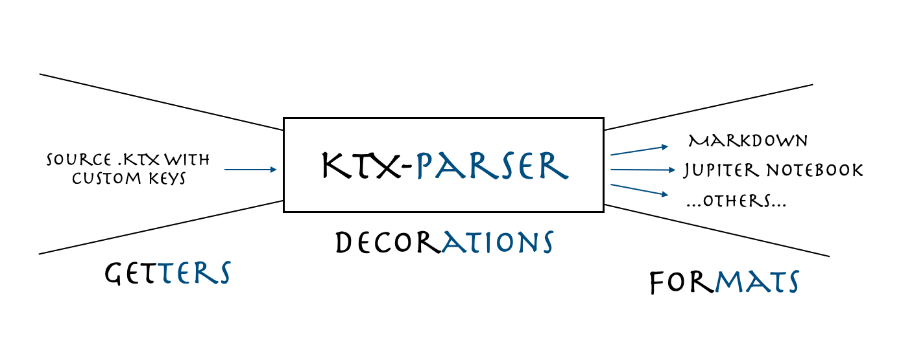

# ktx-parser

Simple parser for plain text (with keys!), to create text indexed with custom keys and to parse it via a python dictionary into an extensible range of formats.

## What

+ A keyed text (extension `.ktx`) is a text file divided into keys and values, made of text and parsed into a dictionary according to a configuration file.
The same file can contain numbered or unnumbered keys and corresponding values

+ The parser can contain html, markdown text, code, and general values with a custom format, and a custom way of distinguishing keys and text. 

## How

+ The parsed dictionary is then converted via a key agnostic method in a range of formats, and through a specific set of decorations (format specific, but still keys agnostics, embellishment of the output). At the moment implemented for markdown, and jupyter notebook, but extensible to other formats.



## Why 

+ Main goal of the code is to generalise the parser used to create the markdown and jupyter notebooks for the repository [numpy-100](https://github.com/rougier/numpy-100).

+ This library is also an exercises to experiment the use of abstract classes in python.

## Is it an overkill?

+ Yes, in its current state, to convert some text only to markdown and jupyter notebook this library is an overkill (for this reason the current version is not on pypi). Though its extensibility to other formats makes it reasonably useful.
## Where to start

Install the library in a virtualenvironment with pip, then run the example in the examples folder:
```
virtualenv venv -p python3.8 
source venv/bin/activate
pip install -r requirements.txt

python examples/convert_examples.py 
```

## Install via github url

```
pip install git+https://github.com/SebastianoF/ktx-parser.git@v0.0.2
```

## Licence

This is an open source repository released under MIT license. Please do contribute 

